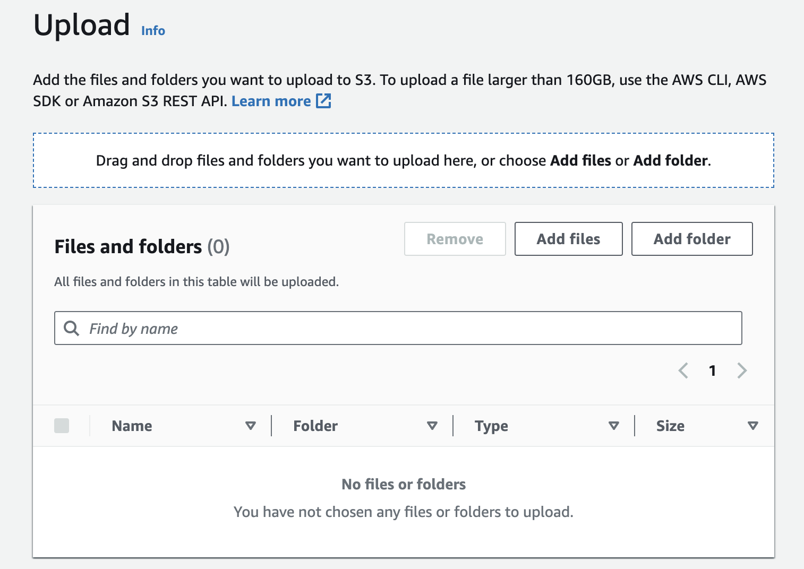
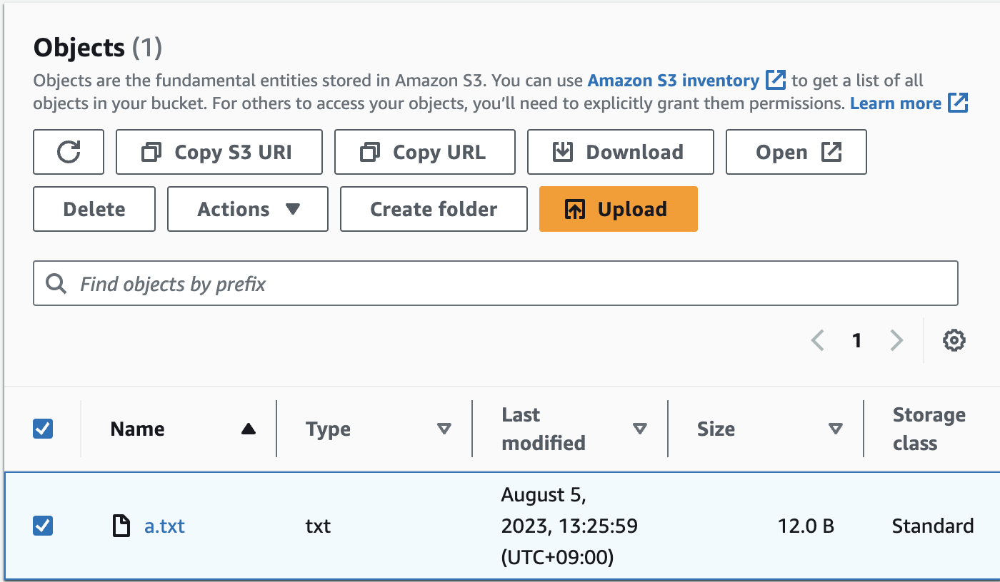
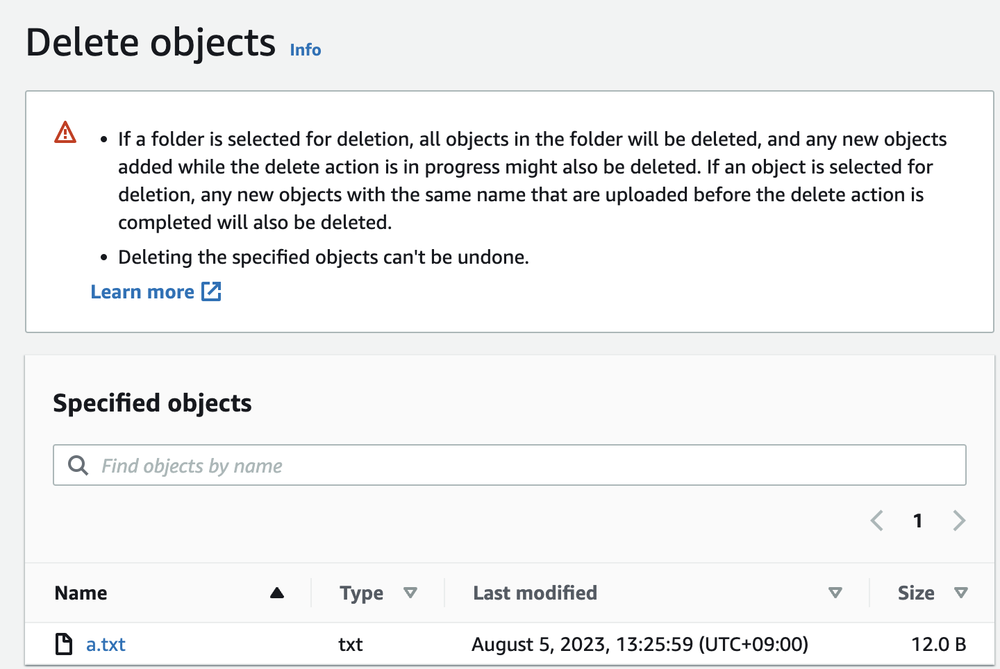

## Create a bucket

### config

1. Bucket name:

   1. Be unique within a partition (aws, aws-cn, aws-us-gov)
   2. 3 ~ 63 characters long
   3. only lowercases, number, dot, hyphens. But avoid using dots.
   4. Cannot change its name after creating a bucket.

2. Bucket region:

   1. Consider latency, costs, and address regulatory requirements.

3. Object Ownership:

   1. ACL(Access control list) disabled. **Bucket owner enforced**. Only bucket owner access the objects in the bucket.
   2. ACL enabled: **Bucket owner preferred**. **Object writer**

4. Public Access settings
   1. `BlockPublicAcls`
   2. `IgnorePublicAcls`
   3. `BlockPublicPolicy`
   4. `RestrictPublicBuckets`
5. Bucket versioning: means of keeping multiple variants of an object in the same bucket.
6. Tags: cost allocation tags
7. Default encryption

## Upload an object to a bucket

### Using AWS Console

Go to `Amazon S3 > Buckets > [Bucket name] > Upload`


### Using AWS Cli

```
aws s3 cp file s3://bucketpath
```

## Download an object

### Using AWS Console



### Using AWS Cli

```
aws s3 cp s3://tinyyard-test/a.txt abcd.txt
```

## Deleting an object

### Using AWS Console



### Using AWS Cli

```
aws s3 rm s3://bucket-name/filename

aws s3 rm s3://tinyyard-test/a.txt
```
